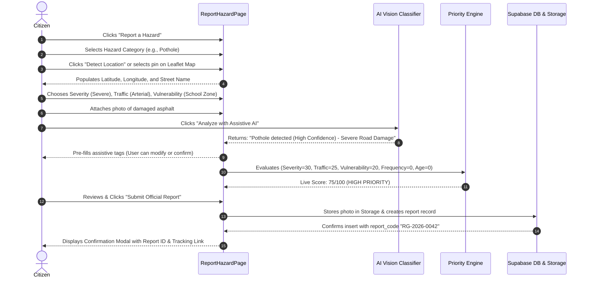
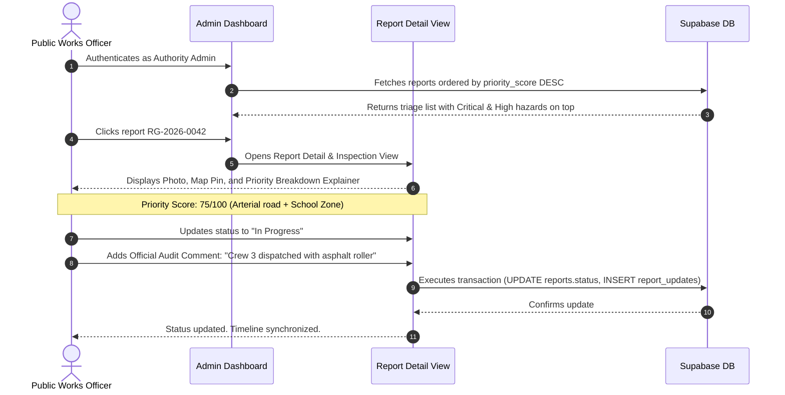

# RoadGuard - Architecture & System Blueprint
**Hackathon:** Drive Safe Hackathon  
**System:** Civic Road-Safety Hazard Reporting, Prioritization, Visualization & Tracking Platform  
**Target Roles:** Citizens (Reporters), Public Works / Municipal Authorities (Admins)  

---

## 1. System Architecture Plan

### 1.1 Architecture Overview
RoadGuard is designed as an enterprise-grade civic technology web application built on **React 18 + TypeScript + Vite**, coupled with **Supabase (PostgreSQL 15+, Supabase Auth, Row-Level Security, and Supabase Storage)**, **Leaflet / OpenStreetMap**, and **Recharts**.

The application operates on a resilient **Hybrid-State Architecture**:
1. **Primary Online Mode:** All hazard reports, updates, image uploads, and role-based actions persist to Supabase in real-time.
2. **Resilient Demo & Fallback Mode:** In case of hackathon venue network instability or missing API credentials, the app transparently falls back to an internal reactive in-memory / LocalStorage database loaded with a curated, realistic municipal road hazard dataset. This guarantees 100% demo reliability without breaking in front of judges.

```mermaid
graph TD
    subgraph "Client Layer (React 18 + TypeScript)"
        CitizenUI[Citizen Reporting & Tracking UI]
        MapUI[Interactive Safety Map (Leaflet)]
        AdminUI[Municipal Authority Dashboard]
        Engine[Road Hazard Priority Engine (TS/SQL)]
        AIClient[Assistive AI Classifier (Vision API / Fallback)]
    end

    subgraph "Bespoke Civic-Tech Design System"
        Tokens[CSS Tokens & Accessible Palette]
        Components[Accessible UI Components]
    end

    subgraph "Backend as a Service (Supabase)"
        Auth[Supabase Auth (JWT & Roles)]
        DB[(PostgreSQL 15+ with RLS)]
        Storage[(Supabase Storage: hazard-evidence)]
        Triggers[DB Functions & Priority Sync]
    end

    CitizenUI -->|Submit Report & Geo-Coordinates| DB
    CitizenUI -->|Upload Photo Evidence| Storage
    CitizenUI -->|Request Assistive Label| AIClient
    Engine -->|Calculate Score & Breakdown| DB
    DB -->|Spatial Query & Status Filters| MapUI
    AdminUI -->|Review, Triage & Change Status| DB
    AdminUI -->|Audit Log Update| DB
    Auth -->|Role-Based Access Control| AdminUI
```

### 1.2 Technology Selection & Rationales

| Layer | Technology | Technical Rationale |
| :--- | :--- | :--- |
| **Frontend Framework** | React 18 + Vite + TypeScript | Instant HMR, static type safety across database types, zero bundler bloat, ultra-fast initial load (< 1s). |
| **Styling & Design System** | Vanilla CSS with Custom Design Tokens | Avoids generic Tailwind UI look; provides a bespoke, authentic civic-tech aesthetic (neutral slate tones, crisp typography, high-contrast semantic alert colors). |
| **Mapping Engine** | Leaflet.js + OpenStreetMap | Open-source, no restrictive credit card/Google Maps API billing quotas, lightweight, supports customizable SVG priority pins and spatial filtering. |
| **Analytics Engine** | Recharts | Composable SVG-based chart library for React with smooth tooltips and crisp resolution across all screen densities. |
| **Backend & Database** | Supabase (PostgreSQL 15+) | Robust relational integrity, foreign key cascading, JSONB support for priority explainability payloads, and Row-Level Security (RLS). |
| **Authentication** | Supabase Auth | Secure JWT session management with custom user metadata and database profile synchronization. |
| **Storage** | Supabase Storage Bucket | Secure storage of citizen photographic evidence with MIME validation and 5MB size limits. |
| **Assistive AI** | Gemini Vision API / Vision Classifier | Suggests hazard categories and severity from uploaded images; explicitly labeled as assistive with mandatory human review. |

---

## 2. Database Schema (PostgreSQL on Supabase)

### 2.1 Complete SQL DDL Schema

```sql
-- ============================================================================
-- ROADGUARD PRODUCTION SCHEMA
-- ============================================================================

-- 1. Custom Types & ENUMs
CREATE TYPE user_role AS ENUM ('citizen', 'admin');
CREATE TYPE hazard_type AS ENUM (
  'pothole',
  'broken_traffic_signal',
  'poor_street_lighting',
  'unsafe_pedestrian_crossing',
  'road_damage',
  'waterlogging',
  'obstruction',
  'other'
);
CREATE TYPE severity_level AS ENUM ('minor', 'moderate', 'severe', 'catastrophic');
CREATE TYPE traffic_exposure_level AS ENUM ('low', 'medium', 'high', 'arterial');
CREATE TYPE vulnerability_zone AS ENUM ('standard', 'transit_hub', 'hospital_zone', 'school_zone');
CREATE TYPE priority_level AS ENUM ('low', 'medium', 'high', 'critical');
CREATE TYPE report_status AS ENUM ('submitted', 'under_review', 'in_progress', 'resolved', 'rejected');

-- 2. User Profiles Table (Synced with Supabase auth.users)
CREATE TABLE public.profiles (
  id UUID PRIMARY KEY REFERENCES auth.users(id) ON DELETE CASCADE,
  full_name TEXT NOT NULL,
  role user_role DEFAULT 'citizen' NOT NULL,
  phone TEXT,
  department TEXT, -- e.g. "Public Works - District 4" for admins
  created_at TIMESTAMPTZ DEFAULT now() NOT NULL,
  updated_at TIMESTAMPTZ DEFAULT now() NOT NULL
);

-- 3. Sequence for Human-Readable Civic Report Codes (e.g., RG-2026-0001)
CREATE SEQUENCE IF NOT EXISTS report_code_seq START WITH 1001;

-- 4. Road Hazard Reports Table
CREATE TABLE public.reports (
  id UUID PRIMARY KEY DEFAULT gen_random_uuid(),
  report_code TEXT UNIQUE NOT NULL,
  user_id UUID REFERENCES public.profiles(id) ON DELETE SET NULL,
  hazard_type hazard_type NOT NULL,
  location_name TEXT NOT NULL,
  latitude DOUBLE PRECISION NOT NULL CHECK (latitude BETWEEN -90.0 AND 90.0),
  longitude DOUBLE PRECISION NOT NULL CHECK (longitude BETWEEN -180.0 AND 180.0),
  description TEXT NOT NULL CHECK (char_length(description) >= 10),
  severity severity_level NOT NULL,
  traffic_exposure traffic_exposure_level NOT NULL DEFAULT 'medium',
  vulnerability_level vulnerability_zone NOT NULL DEFAULT 'standard',
  
  -- Priority Calculation Outputs
  priority_score NUMERIC(5, 2) NOT NULL CHECK (priority_score BETWEEN 0.0 AND 100.0),
  priority_level priority_level NOT NULL,
  priority_breakdown JSONB NOT NULL DEFAULT '{}'::jsonb,
  
  -- Lifecycle Status
  status report_status NOT NULL DEFAULT 'submitted',
  
  -- Media & AI Metadata
  image_url TEXT,
  ai_suggestion JSONB,
  
  -- Timestamps
  created_at TIMESTAMPTZ DEFAULT now() NOT NULL,
  updated_at TIMESTAMPTZ DEFAULT now() NOT NULL,
  resolved_at TIMESTAMPTZ
);

-- 5. Audit Trail & Status Timeline Table
CREATE TABLE public.report_updates (
  id UUID PRIMARY KEY DEFAULT gen_random_uuid(),
  report_id UUID NOT NULL REFERENCES public.reports(id) ON DELETE CASCADE,
  admin_id UUID REFERENCES public.profiles(id) ON DELETE SET NULL,
  previous_status report_status,
  new_status report_status NOT NULL,
  comment TEXT NOT NULL,
  created_at TIMESTAMPTZ DEFAULT now() NOT NULL
);

-- 6. Indices for High-Performance Queries
CREATE INDEX idx_reports_status ON public.reports(status);
CREATE INDEX idx_reports_priority ON public.reports(priority_level, priority_score DESC);
CREATE INDEX idx_reports_hazard ON public.reports(hazard_type);
CREATE INDEX idx_reports_geo ON public.reports(latitude, longitude);
CREATE INDEX idx_reports_created ON public.reports(created_at DESC);
CREATE INDEX idx_reports_code ON public.reports(report_code);
CREATE INDEX idx_report_updates_report_id ON public.report_updates(report_id, created_at ASC);

-- 7. Automated Report Code Generator Trigger
CREATE OR REPLACE FUNCTION generate_report_code()
RETURNS TRIGGER AS $$
BEGIN
  IF NEW.report_code IS NULL OR NEW.report_code = '' THEN
    NEW.report_code := 'RG-' || TO_CHAR(NOW(), 'YYYY') || '-' || LPAD(NEXTVAL('report_code_seq')::TEXT, 4, '0');
  END IF;
  RETURN NEW;
END;
$$ LANGUAGE plpgsql;

CREATE TRIGGER trg_generate_report_code
BEFORE INSERT ON public.reports
FOR EACH ROW
EXECUTE FUNCTION generate_report_code();
```

---

## 3. Project Folder Structure

```
c:/Users/acer/Desktop/RoadGaurd/
├── .env.example
├── index.html
├── package.json
├── tsconfig.json
├── vite.config.ts
├── public/
│   ├── favicon.svg
│   └── markers/                # Leaflet SVG priority markers
│       ├── marker-critical.svg
│       ├── marker-high.svg
│       ├── marker-medium.svg
│       └── marker-low.svg
└── src/
    ├── assets/                 # Brand emblems, civic graphics, sample evidence
    ├── components/
    │   ├── common/             # Reusable UI primitives
    │   │   ├── Badge.tsx       # Priority & Status semantic badges
    │   │   ├── Button.tsx
    │   │   ├── Card.tsx
    │   │   ├── Input.tsx
    │   │   ├── Modal.tsx
    │   │   ├── Select.tsx
    │   │   └── Spinner.tsx
    │   ├── layout/             # Structure & Navigation
    │   │   ├── Navbar.tsx
    │   │   ├── Footer.tsx
    │   │   ├── AdminSidebar.tsx
    │   │   └── PageHeader.tsx
    │   ├── map/                # Leaflet spatial components
    │   │   ├── SafetyMap.tsx
    │   │   ├── MapFilters.tsx
    │   │   ├── MapPopup.tsx
    │   │   └── LocationPicker.tsx
    │   ├── reports/            # Reporting components
    │   │   ├── ReportForm.tsx
    │   │   ├── HazardTypeSelector.tsx
    │   │   ├── ImageUploadWithAI.tsx
    │   │   ├── PriorityExplainer.tsx
    │   │   ├── ReportCard.tsx
    │   │   └── ReportTable.tsx
    │   ├── tracking/           # Citizen tracking
    │   │   ├── StatusTimeline.tsx
    │   │   ├── ReportSearchBox.tsx
    │   │   └── AuditTrailView.tsx
    │   └── analytics/          # Authority data visualizations
    │       ├── CategoryDistributionChart.tsx
    │       ├── StatusBreakdownChart.tsx
    │       ├── PriorityHistogram.tsx
    │       └── ResolutionKpiCards.tsx
    ├── hooks/
    │   ├── useAuth.ts
    │   ├── useReports.ts
    │   ├── useGeolocation.ts
    │   └── useDebounce.ts
    ├── lib/
    │   └── supabase.ts         # Supabase client singleton & auth listener
    ├── pages/
    │   ├── LandingPage.tsx
    │   ├── ReportHazardPage.tsx
    │   ├── SafetyMapPage.tsx
    │   ├── TrackReportPage.tsx
    │   ├── LoginPage.tsx
    │   ├── RegisterPage.tsx
    │   └── admin/
    │       ├── AdminDashboardPage.tsx
    │       ├── AdminReportDetailPage.tsx
    │       └── AdminAnalyticsPage.tsx
    ├── services/
    │   ├── priorityEngine.ts   # Core rule-based calculation & breakdown
    │   ├── reportsService.ts   # Unified API (Supabase + Local Fallback)
    │   ├── storageService.ts   # Image upload validation & storage
    │   └── aiClassifier.ts     # Assistive AI vision analysis
    ├── styles/
    │   ├── index.css           # Global tokens, typography, CSS reset
    │   ├── components.css      # Civic-tech component styles
    │   └── map.css             # Leaflet overrides & marker pulses
    ├── types/
    │   ├── database.types.ts   # Auto-aligned Postgres schema types
    │   ├── report.types.ts     # Domain models & filter contracts
    │   └── priority.types.ts   # Score calculation contracts & factors
    └── utils/
        ├── demoData.ts         # 15 realistic civic road hazards for demo
        ├── formatters.ts       # Dates, coordinates, badges
        └── validators.ts       # Form & file sanitization rules
```

---

## 4. Page and Component Hierarchy

```
App.tsx (Router, AuthProvider, ReportsProvider)
├── Navbar (Global Brand, Nav Links, Role Badge, Auth Actions)
├── Routes:
│   ├── "/" ── LandingPage
│   │   ├── HeroSection (Slogan, CTAs: "Report a Hazard" & "Explore Safety Map")
│   │   ├── ProblemStatementSection
│   │   ├── SolutionWorkflowSection (Citizen → Priority Engine → Authority → Resolution)
│   │   ├── KeyFeaturesGrid
│   │   ├── SafetyMapLivePreview
│   │   ├── CivicImpactStats
│   │   └── CallToActionSection
│   │
│   ├── "/report" ── ReportHazardPage
│   │   └── ReportForm
│   │       ├── HazardTypeSelector (8 Civic Categories)
│   │       ├── LocationPicker (GPS detection + OpenStreetMap coordinate picker)
│   │       ├── SeveritySelector & EnvironmentalContext (Traffic exposure + Vulnerability zone)
│   │       ├── ImageUploadWithAI (Evidence dropzone + Assistive AI classification trigger)
│   │       ├── LivePriorityPreview (Real-time score & factor breakdown before submit)
│   │       └── SubmissionSuccessModal (Shows generated `RG-2026-XXXX` + Direct Tracking Link)
│   │
│   ├── "/map" ── SafetyMapPage
│   │   ├── MapFilters (Category, Priority [Critical, High, Medium, Low], Status, Search query)
│   │   ├── SafetyMap (Leaflet Container, TileLayer, SVG Priority Markers)
│   │   │   └── MapPopup (Quick summary, photo thumbnail, priority tag, "View Full Record")
│   │   └── ReportDetailDrawer (Slide-over drawer with full evidence and history on marker click)
│   │
│   ├── "/track" & "/track/:reportCode" ── TrackReportPage
│   │   ├── ReportSearchBox (Search input with sample demo code buttons)
│   │   ├── ReportHeader (Report Code, Current Status Badge, Submission Date)
│   │   ├── StatusTimeline (Visual stepper: Submitted → Under Review → In Progress → Resolved)
│   │   ├── HazardEvidenceCard (Photo, exact location, citizen description)
│   │   ├── PriorityTransparencyCard (Why this priority was assigned)
│   │   └── AuditTrailView (Official comments and department action logs)
│   │
│   ├── "/auth/login" & "/auth/register" ── AuthPages
│   │   └── QuickDemoRoleSwitcher (One-click toggle: "Sign In as Citizen" or "Sign In as City Works Official")
│   │
│   └── "/admin" ── AdminLayout (Sidebar + Breadcrumb + Authority Header)
│       ├── "/admin/dashboard" ── AdminDashboardPage
│       │   ├── ResolutionKpiCards (Total Reports, Critical Backlog, Active Crews, Avg Resolution Time)
│       │   ├── PriorityFilterTabs (All, Critical First, Under Review, In Progress)
│       │   └── ReportTable (Sortable, Searchable, Priority Score with Reason Tooltip, Quick Action Menu)
│       │
│       ├── "/admin/reports/:id" ── AdminReportDetailPage
│       │   ├── InspectionGrid (Photo Evidence + Map Pin + Detailed Citizen Report)
│       │   ├── PriorityExplainer (Detailed 5-factor breakdown with mathematical weights)
│       │   └── AuthorityActionPanel (Status Transition Selector, Department Crew Assignment, Audit Note)
│       │
│       └── "/admin/analytics" ── AdminAnalyticsPage
│           ├── CategoryDistributionChart (Recharts Bar Chart)
│           ├── PriorityHistogram (Distribution of Low to Critical)
│           ├── StatusBreakdownChart (Donut Chart)
│           └── ResolutionVelocityMetric
│
└── Footer (Civic disclaimer, OpenStreetMap attribution, Hackathon metadata)
```

---

## 5. Citizen User Flow



---

## 6. Admin Authority Workflow



---

## 7. Road Hazard Priority Engine Formula

### 7.1 Mathematical Scoring Model
The **Road Hazard Priority Engine** calculates an objective, deterministic score between **0 and 100 points**:

$$\mathbf{P_{total}} = \mathbf{S_{sev}} + \mathbf{T_{traf}} + \mathbf{V_{vuln}} + \mathbf{F_{freq}} + \mathbf{A_{age}}$$

Each component represents a concrete, verifiable road-safety factor:

| Factor | Variable | Max Pts | Criteria & Sub-weights |
| :--- | :---: | :---: | :--- |
| **Hazard Severity** | $S_{sev}$ | **35** | • **Minor (10 pts):** Superficial surface cracking, minor curb scrape.<br>• **Moderate (20 pts):** Medium pothole (< 5cm deep), faded road marking.<br>• **Severe (30 pts):** Deep pothole (> 5cm), malfunctioning traffic signal.<br>• **Catastrophic (35 pts):** Cave-in, sinkhole, collapsed bridge rail, live downed wire. |
| **Traffic Exposure** | $T_{traf}$ | **25** | • **Low (5 pts):** Residential alley, dead-end road.<br>• **Medium (15 pts):** Collector road, 2-lane neighborhood corridor.<br>• **High (20 pts):** Major multi-lane urban street, commercial avenue.<br>• **Arterial (25 pts):** High-speed arterial corridor, highway ramp, bypass. |
| **Pedestrian Vulnerability** | $V_{vuln}$ | **20** | • **Standard (5 pts):** Standard roadway with low pedestrian volume.<br>• **Transit Hub (12 pts):** Metro/bus transit terminal, passenger drop-off zone.<br>• **Hospital Zone (16 pts):** Emergency ambulance route, elder care facility area.<br>• **School Zone (20 pts):** Elementary/high school crossing, playground perimeter. |
| **Spatial Cluster Frequency** | $F_{freq}$ | **10** | • **Single Report (0 pts):** No other reports within 150m radius.<br>• **Cluster of 2–3 (5 pts):** Corroborating reports indicating widespread hazard.<br>• **Severe Cluster 4+ (10 pts):** Multiple independent reports in same road segment. |
| **Resolution Age Penalty** | $A_{age}$ | **10** | • **< 24 Hours (0 pts):** Freshly reported.<br>• **1 – 3 Days (3 pts):** Pending initial review.<br>• **3 – 7 Days (6 pts):** Overdue standard inspection.<br>• **> 7 Days (10 pts):** Chronic unresolved hazard requiring escalation. |

### 7.2 Priority Level Classification & Operational SLAs
- **0 – 39 Points → LOW PRIORITY (Green / Slate):** Scheduled for routine municipal maintenance cycles (target resolution: 14 business days).
- **40 – 64 Points → MEDIUM PRIORITY (Amber / Yellow):** Standard public works inspection and dispatch (target resolution: 5 business days).
- **65 – 84 Points → HIGH PRIORITY (Orange):** Accelerated dispatch required; road safety significantly degraded (target resolution: 24–48 hours).
- **85 – 100 Points → CRITICAL PRIORITY (Red / Crimson):** Immediate emergency intervention; acute threat to life and vehicular stability (target resolution: < 12 hours).

### 7.3 Explainability JSON Schema
Every calculation persists an auditable `priority_breakdown` payload:
```json
{
  "total_score": 75.0,
  "priority_level": "HIGH",
  "calculated_at": "2026-09-28T13:20:00Z",
  "breakdown": [
    { "factor": "Hazard Severity", "score": 30, "max": 35, "detail": "Deep pothole (>5cm depth) posing vehicle tire rupture risk" },
    { "factor": "Traffic Exposure", "score": 25, "max": 25, "detail": "Arterial road corridor with continuous commercial transit" },
    { "factor": "Pedestrian Vulnerability", "score": 20, "max": 20, "detail": "Directly adjacent to municipal school crossing" },
    { "factor": "Report Frequency", "score": 0, "max": 10, "detail": "Single verified report in 150m radius" },
    { "factor": "Resolution Aging", "score": 0, "max": 10, "detail": "Reported within past 24 hours" }
  ]
}
```

---

## 8. Security & Authorization Model

### 8.1 Row-Level Security (RLS) Policies

```sql
-- Enable RLS on all tables
ALTER TABLE public.profiles ENABLE ROW LEVEL SECURITY;
ALTER TABLE public.reports ENABLE ROW LEVEL SECURITY;
ALTER TABLE public.report_updates ENABLE ROW LEVEL SECURITY;

-- 1. Profiles Table Policies
-- Any authenticated user can read public profile names
CREATE POLICY "Public profiles are readable by authenticated users"
ON public.profiles FOR SELECT
TO authenticated
USING (true);

-- Users can only modify their own profile
CREATE POLICY "Users can update their own profile"
ON public.profiles FOR UPDATE
TO authenticated
USING (auth.uid() = id);

-- 2. Reports Table Policies
-- Everyone (including anonymous/public users) can view reports for the safety map & tracking
CREATE POLICY "Reports are publicly viewable"
ON public.reports FOR SELECT
TO public
USING (true);

-- Authenticated citizens can submit new reports
CREATE POLICY "Authenticated users can create reports"
ON public.reports FOR INSERT
TO authenticated
WITH CHECK (auth.uid() = user_id OR user_id IS NULL);

-- Only verified admins can update report status or official fields
CREATE POLICY "Only admins can update reports"
ON public.reports FOR UPDATE
TO authenticated
USING (
  EXISTS (
    SELECT 1 FROM public.profiles
    WHERE profiles.id = auth.uid()
    AND profiles.role = 'admin'
  )
);

-- 3. Report Updates (Audit Trail) Policies
-- Public can view status updates for tracking transparency
CREATE POLICY "Report updates are publicly viewable"
ON public.report_updates FOR SELECT
TO public
USING (true);

-- Only admins can insert official status updates
CREATE POLICY "Only admins can insert status updates"
ON public.report_updates FOR INSERT
TO authenticated
WITH CHECK (
  EXISTS (
    SELECT 1 FROM public.profiles
    WHERE profiles.id = auth.uid()
    AND profiles.role = 'admin'
  )
);
```

### 8.2 Client-Side Security & Validation
1. **Never Expose Supabase Service Keys:** The frontend only uses `VITE_SUPABASE_ANON_KEY` and `VITE_SUPABASE_URL`.
2. **File Upload Hardening:** Strict client-side validation of file type (`image/jpeg`, `image/png`, `image/webp`) and file size (≤ 5MB) before dispatching to Supabase Storage.
3. **Input Sanitization:** Geolocation values constrained within valid coordinates $(-90 \le lat \le 90, -180 \le lon \le 180)$, and textual descriptions sanitized to prevent XSS.

---

## 9. Development Phases

```
Phase 1: Architecture, Schemas, & Project Foundation
└── Setup Vite + React + TypeScript, Design Tokens, and Base CSS.

Phase 2: Civic Design System & Common UI Components
└── Cards, Badges, Modals, Inputs, Buttons, Navbars, Footers.

Phase 3: Authentication & Role Management
└── Supabase Auth + Demo Role Switcher (Citizen vs. Authority Admin).

Phase 4: Hazard Reporting Engine & Client Geolocation
└── Multi-step form, Leaflet pin picker, severity selector, photo dropzone.

Phase 5: Transparent Priority Engine Implementation
└── TS scoring engine, factor breakdown generator, and explanation modal.

Phase 6: Interactive Safety Map
└── Leaflet OpenStreetMap integration, custom SVG priority pins, filter drawer.

Phase 7: Authority Admin Dashboard
└── KPI summary cards, filterable triage table, status update modal with audit comments.

Phase 8: Citizen Report Tracking Workflow
└── Direct search by Report Code (`RG-2026-XXXX`), visual step timeline, public audit log.

Phase 9: Assistive AI Image Classification
└── Assistive image tagger with clear user-confirmation disclaimer and offline fallback.

Phase 10: Curated Demo Dataset, E2E Polish & Pitch Validation
└── 15 realistic civic hazards, responsive cross-device review, and pitch timing rehearsal.
```

---

## 10. Potential Failure Points & Mitigations

| # | Potential Failure Point | Risk | Engineering Mitigation |
| :-: | :--- | :---: | :--- |
| **1** | **Hackathon venue WiFi failure or high latency** | High | **Dual-Engine Architecture:** The data access layer checks Supabase connectivity. If unreachable or credentials unconfigured, it immediately falls back to a robust in-memory/LocalStorage store pre-populated with 15 real-world hazard records. |
| **2** | **Browser Geolocation permission denied** | Medium | User is immediately presented with an interactive Leaflet map where clicking anywhere drops a pin and reverse-geocodes coordinates automatically. |
| **3** | **OpenStreetMap tile rate-limiting** | Low | Custom tile caching headers, fallback tile server URLs (`cartodb-basemaps`), and graceful SVG background placeholder. |
| **4** | **Assistive AI API quota limit / network timeout** | Medium | AI classification is purely assistive. If the vision endpoint times out or errors, the UI displays "AI Assistant offline — please select hazard manually" without blocking report submission. |
| **5** | **Large photo uploads slowing mobile network** | High | Client-side HTML5 Canvas auto-compression compresses any uploaded photo to ≤ 500KB before transmission. |

---

## 11. Testing Strategy

### 11.1 Priority Engine Edge Case Testing Matrix
- **Boundary Test 1 (All Minima):** Minor hazard (10) + Low traffic (5) + Standard zone (5) + 0 cluster (0) + 0 age (0) = **20.0 → Correctly LOW**.
- **Boundary Test 2 (All Maxima):** Catastrophic hazard (35) + Arterial road (25) + School zone (20) + Cluster 4+ (10) + Age > 7 days (10) = **100.0 → Correctly CRITICAL**.
- **Middle Threshold Test:** Score of 64.9 vs 65.0 must cleanly distinguish **MEDIUM** from **HIGH**.
- **Determinism Check:** Identical inputs must always yield the exact same score and factor breakdown array.

### 11.2 End-to-End Workflow Integration Test
1. Citizen submits new report with photo & coordinates.
2. System produces formatted `RG-2026-XXXX` code.
3. Safety Map immediately renders new marker with correct priority color.
4. Admin Dashboard displays report at correct position in triage queue.
5. Admin updates status to "In Progress" with note.
6. Public Tracking page reflects transition on timeline with zero refresh lag.

### 11.3 Accessibility & Responsive Testing
- WCAG 2.1 AA contrast ratio checks on all text, badges, and map markers.
- Layout verification across Mobile (375px), Tablet (768px), and Desktop (1440px).

---

## 12. Hackathon Demo Strategy (5-Minute Winning Pitch Flow)

| Time | Stage | Screen / Action | Speaker Talking Points |
| :---: | :--- | :--- | :--- |
| **0:00 - 0:45** | **The Civic Problem** | Landing Page (`/`) | "Every day, citizens navigate broken roads and dark crosswalks. Municipal hotlines are black holes, and public works departments are overwhelmed with unprioritized complaints. RoadGuard creates an accountable civic loop: Report, Prioritize, Visualize, Act, and Track." |
| **0:45 - 2:00** | **Citizen Report & Assistive AI** | Report Form (`/report`) | "Let's report a dangerous pothole near Lincoln Elementary. We drop our map pin, upload a photo. Notice our Assistive AI analyzes the image and suggests 'Pothole' with high confidence. The citizen retains control to verify. Watch the live Road Hazard Priority Engine calculate a score of 78/100 (HIGH) due to the school zone." |
| **2:00 - 2:50** | **Interactive Safety Map** | Safety Map (`/map`) | "Once submitted, the hazard appears instantly on the civic safety map with code `RG-2026-0014`. Notice the clean visual distinction between priority levels. This represents verified citizen reports, empowering communities with spatial awareness." |
| **2:50 - 3:50** | **Authority Dashboard & Priority Explainability** | Admin Portal (`/admin`) | "Now switching to the Public Works Authority view. The dashboard sorts hazards by calculated risk. Open our report: the judge can see the transparent mathematical breakdown—30 pts severity, 25 pts arterial traffic, 20 pts school zone. The supervisor updates status to 'In Progress' and dispatches Crew 4." |
| **3:50 - 4:30** | **Citizen Accountability & Tracking** | Track Report (`/track`) | "Back on the citizen tracking portal, entering `RG-2026-0014` shows the live timeline updated to 'In Progress' with the crew dispatch note. The citizen is never left wondering." |
| **4:30 - 5:00** | **Civic Analytics & Wrap-up** | Analytics (`/admin/analytics`) | "Our analytics track resolution velocity and category frequency across municipal districts. RoadGuard turns fragmented complaints into a transparent, prioritized civic safety workflow. Thank you." |
